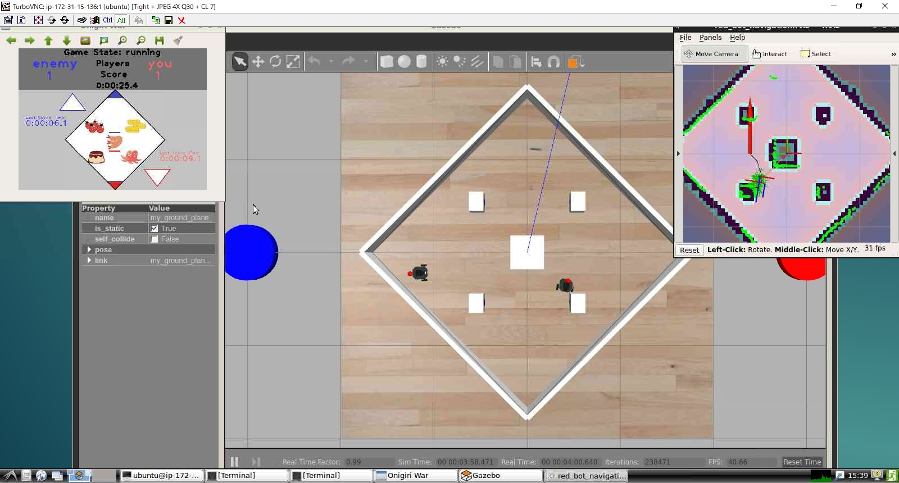

# AWS EC2でGPU付きのインスタンスでROS開発環境をつくる
## はじめに
GPU付きインスタンスを作成できるAWSで、快適なROS開発環境が作れるかトライした。

Gazeboで、Realtime Factor 1.0、FPS 30～40程度が動作する環境を構築できた。



## インスタンスを作成する
AWSにはGPU付きのインスタンスが2種類ある。pから始まるタイプは機械学習など計算用、gから始まるタイプがグラフィック用である。
ここでは、「g2.2xlarge」を使用した例で説明する。

なお、GPU付きインスタンスは起動インスタンス数制限が0(1つも起動出来ない)になっている場合がある。その場合、制限の緩和をサポートへ依頼する必要がある。

OSイメージは標準で準備されたUbuntu16.04を選ぶ。インスタンスタイプでg2.2xlargeを選ぶ。あとはそのままの設定で良いが、ボリュームは変更した方が良い。標準では8GBであるため拡張する。20GB位なら良いだろう。


## Lubuntuをインストールする
```
sudo apt-get install -y lubuntu-desktop
```

## NVidiaのドライバーをインストールする
参考) https://docs.aws.amazon.com/ja_jp/AWSEC2/latest/UserGuide/install-nvidia-driver.html
```
#システムをアップデート
sudo apt-get update -y
sudo apt-get upgrade -y linux-aws
#再起動
sudo reboot
#必要なパッケージをインストール
sudo apt-get install -y gcc make linux-headers-$(uname -r)

#標準のオープンソース版ドライバーを無効にする
cat << EOF | sudo tee --append /etc/modprobe.d/blacklist.conf
blacklist vga16fb
blacklist nouveau
blacklist rivafb
blacklist nvidiafb
blacklist rivatv
EOF

#カーネルパラメータでオープンソース版ドライバーを無効にする
cat <<EOF | sudo tee --append /etc/default/grub
GRUB_CMDLINE_LINUX="rdblacklist=nouveau"
EOF

#ブートローダーを再構築する
sudo update-grub


# NVIDIA製ドライバーをダウンロードする
# 適合するドライバーは　http://www.nvidia.com/Download/Find.aspx　から探す
# G2インスタンスの場合…Product Type:GRID、Product Series:GRID Series、Product:GRID K520、Operating System:Linux 64-bit
# 下記のリンクの[430.40]を修正すると最新バージョンにあわせられる

wget http://us.download.nvidia.com/XFree86/Linux-x86_64/430.40/NVIDIA-Linux-x86_64-430.40.run

# インストール実行
sudo service lightdm stop
chmod +x NVIDIA-Linux*.run
sudo ./NVIDIA-Linux*.run		

# ウィーザードが動く
# [Continue installation]を押す
# WARNINGがでるがOKを押す
# 「Would you like to run the nvidia-xconfig～」→Noを押す

# X Windowの設定を変更 BusIDはlspciコマンドで確認できる。
sudo nvidia-xconfig --use-display-device=None --busid=PCI:0:3:0

# 再起動
sudo reboot
```


## TurboVNCとVirtualGLをインストールする

```
# gnome-terminal and xterm is needed
sudo apt-get install -y gnome-terminal xterm

# Install VirtualGL
wget https://sourceforge.net/projects/virtualgl/files/2.6.2/virtualgl_2.6.2_amd64.deb/download -O virtualgl_2.6.2_amd64.deb && \
sudo dpkg -i virtualgl*.deb && \
rm virtualgl*.deb

# Install TurboVNC
wget https://sourceforge.net/projects/turbovnc/files/2.2.2/turbovnc_2.2.2_amd64.deb/download -O turbovnc_2.2.2_amd64.deb && \
sudo dpkg -i turbovnc*.deb && \
rm turbovnc*.deb

# Config VirtualGL
sudo /opt/VirtualGL/bin/vglserver_config -config +s +f -t

# Install some OpenGL Utils
sudo apt install mesa-utils

```


## 動作確認

```
/opt/TurboVNC/bin/vncserver
# 初回にVNCサーバーに接続する際のパスワードを決めるように求められる。

```

次に、ローカルPCからTurboVNC Viewerを使ってアクセスする。

LXTerminalを開いて、下記を入力して動作確認をする。

```
vglrun glxgear
#ギアーが回ってる３Dが表示されればOK

vglrun firefox http://webglreport.com/
#「This browser supports WebGL 1」とでればOK

```


### (参考)ローカルPCの準備
ローカルPC側の準備をする。Windowsを想定する。
まず下記のソフトウェアをインストールする。
1. Tera Term( https://forest.watch.impress.co.jp/library/software/utf8teraterm/ )をインストール
2. TurboVNC Viewer( https://sourceforge.net/projects/turbovnc/ )をインストール

Tera TermでVPSサーバーにSSHで接続する。(参考 https://ttssh2.osdn.jp/manual/ja/usage/ssh.html )
ここでProxy環境下の場合は、先にProxyの設定をしておく。(参考 https://ttssh2.osdn.jp/manual/ja/usage/proxy.html )
AWSの場合、標準のユーザー名は「ubuntu」である。パスワードはない。
インスタンスを作成する際にキーファイルを作成しているはずなので、それを使ってログインする。
(参考 https://dev.classmethod.jp/cloud/aws/aws-beginner-ec2-ssh/)

ログインできたら、次にポート転送の設定をする。
1. Tera Termのメニュー　設定→SSH転送
2. 追加をクリック
3. 下記の通り設定する
 - ローカルのポート: `5901`
 - リッスン: (空白)
 - リモート側のホスト: (空白)
 - ポート: `5901`
4. OK→OK

設定後、設定ファイルを保存しておくと便利である。
(参考 https://ttssh2.osdn.jp/manual/ja/setup/teraterm.html)

次に、TurboVNC Viewerを立ち上げる。
`127.0.0.1:1`と入力しConnectをクリックする。

これでデスクトップが表示されるはずである。


## スワップ領域を設定する
AWSは標準ではスワップ領域は設定されていないためメモリ不足になるとソフトが終了してしまう。
下記でスワップファイルを生成しスワップ領域を定義できる。
```
sudo dd if=/dev/zero of=/var/swapvaol bs=1M count=4096
sudo mkswap /var/swapvaol
sudo chmod 600 /var/swapvaol
sudo swapon /var/swapvaol
sudo sh -c "echo /var/swapvaol swap swap defaults 0 0 >> /etc/fstab"
```

## Gazeboのインストール
kineticの標準のGazeboはカメラ画像取得のところにバグがあるらしく、VNC経由だとエラーがでるため、Gazebo7を最新版にUpgradeする。

```
# install new version gazebo
sudo sh -c 'echo "deb http://packages.osrfoundation.org/gazebo/ubuntu-stable `lsb_release -cs` main" > /etc/apt/sources.list.d/gazebo-stable.list'
wget http://packages.osrfoundation.org/gazebo.key -O - | sudo apt-key add -
sudo apt-get update
sudo apt-get install gazebo7 -y
```

## ROS環境のインストール
[README.md](../README.md)と同じ方法でROS環境を入れる。

OpenGL(3Dアクセラレーション)を使うアプリは、コマンドの前にvglrunを入れる必要がある。
下記でエイリアスを設定しておくと意識せずに使える。
```
echo "alias roslaunch=\"vglrun roslaunch\"" >> ~/.bash_aliases
echo "alias rviz=\"vglrun rviz\"" >> ~/.bash_aliases
```

ただし、環境起動用スクリプト（例えば scripts/sim_with_judge.sh）を起動するときに
```
bash scripts/sim_with_judge.sh
```
とするとエイリアスが読み込まれないので起動できない。
下記のようにすると起動できる。
```
source scripts/sim_with_judge.sh
```
