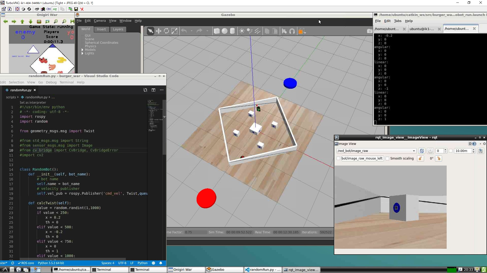

このドキュメントは記録用に残している古いものです。最新の情報は[CloudInstall(AWS_GPU2_x11vnc).md](CloudInstall(AWS_GPU2_x11vnc).md	)をご確認ください。


# クラウド環境でのROS開発環境構築について
## はじめに
クラウド環境におけるROS開発環境というと、AWSのRoboMaker、ROS Development Studioなど、いくつか実装が見られる。
手軽に使える反面、ピュアなROS開発環境（ローカルなUbuntuにインストールされた環境の意）との違いが多いのが難点となる。

そこで今回は、
ピュアなROS環境とほぼ同じ環境をクラウド上に構築する事とした。

## どれくらい使えるのか
遅いがギリギリ使えるといった程度。

4CPUのサーバーにしても、FPSは8～10、Realtime factorは0.8程度。2CPUでは、Realtime factorは0.7以下になる。
操作はカクカクしているが、それほど問題はない。

VPSはGPUが無いのはもちろんのこと、一切のグラフィックチップがついていないからだと思われる。
たとえオンボードだったとしても、グラフィックチップがあるローカルPCとは違うのだろう。

AWSのGPUつきのVPSにすれば、ローカルPC以上の性能が出せる。[別資料に記載](CloudInstall(AWS_GPU).md)した。

## クラウドの選定
気軽にトライできる環境として、さくらVPS および AWS Lightsailおよびec2を対象とした。


さくらVPSは2週間無料プランがある。
プランはメモリ4G以上が推奨される。2G以下でも問題無く動作はするが、遅い。
2週間たつと2ヶ月分が請求されるので注意が必要。安くはない。
（2019/8/1現在、大阪リージョンはVNCコンソールに問題が生じているため石狩リージョンがおすすめ。ただし大阪リージョンでも下記の説明上は問題無い）

AWS Lightsailの無料プランは最も性能が低いプランのみとなる。動作はするが遅い。
Lightsailでも4CPUになると結構高い。Lightsailは月額費用のみなので、注意が必要。

AWS ec2ならば、インスタンスを起動している間だけの請求になる。標準で用意されているUbuntu16.04のマシンイメージを使う。インスタンスタイプはm4.xlargeならばまずまず使える。GPUがついたタイプ(例えばg2.2xlarge)ならば高FPSでGazeboが動作する可能性があるが、このタイプは初期状態ではインスタンス数制限が0に設定されており制限緩和を申請する必要がある。

AWS ec2は標準では容量が足りない場合がある。ec2の管理画面のボリュームからボリューム変更を行う事ができる。
m4.xlargeの場合、初期設定では8Gbである。20Gbあれば安心だ。


## インストール手順
### さくらVPSの場合
まず、Ubuntu 16.04をインストールする。(参考 https://r17u.hatenablog.com/entry/2017/12/28/171607)
さくらのVPSコントロールパネルにブラウザでアクセスして、クリックするだけでインストールできる。
標準OSの中にUbuntu 16.04がある。
インストールが完了したら、VPSコントロールパネルから、シリアルコンソールを選ぶ。

下記を実行する。
```
sudo apt-get update
sudo apt-get upgrade -y

# Install Lubuntu
sudo apt-get install -y lubuntu-desktop

# gnome-terminal is needed
sudo apt-get install -y gnome-terminal

# Install TurboVNC
wget https://sourceforge.net/projects/turbovnc/files/2.2.2/turbovnc_2.2.2_amd64.deb/download -O turbovnc_2.2.2_amd64.deb && \
sudo dpkg -i turbovnc*.deb && \
rm turbovnc*.deb

# install new version gazebo
sudo sh -c 'echo "deb http://packages.osrfoundation.org/gazebo/ubuntu-stable `lsb_release -cs` main" > /etc/apt/sources.list.d/gazebo-stable.list'
wget http://packages.osrfoundation.org/gazebo.key -O - | sudo apt-key add -
sudo apt-get update
sudo apt-get install gazebo7 -y

# Cleanup
sudo apt-get clean

# Reboot
sudo shotdown -r now
```
再起動するのを待ち、下記を入力する。VNCサーバーが起動する。最初だけパスワードを決めるように要求される。Read-onlyはnoでよい。
```
# start vnc server
/opt/TurboVNC/bin/vncserver
```

#### AWSの場合の違い
AWSは標準ではSWAPがない。
なので、メモリ不足しGazeboが動かない。そこで下記のようにスワップ領域を作る。
これは、いつ実行しても良い。

```
sudo dd if=/dev/zero of=/var/swapvaol bs=1M count=4096
sudo mkswap /var/swapvaol
sudo chmod 600 /var/swapvaol
sudo swapon /var/swapvaol
sudo sh -c "echo /var/swapvaol swap swap defaults 0 0 >> /etc/fstab"
```

ec2の場合、使用しない時はインスタンス停止するようにすると良い。課金が停止される。
### ローカルPC側の操作
次にローカルPC側の準備をする。Windowsを想定する。
まず下記のソフトウェアをインストールする。
1. Tera Term( https://forest.watch.impress.co.jp/library/software/utf8teraterm/ )をインストール
2. TurboVNC Viewer( https://sourceforge.net/projects/turbovnc/ )をインストール

Tera TermでVPSサーバーにSSHで接続する。(参考 https://ttssh2.osdn.jp/manual/ja/usage/ssh.html )
ここでProxy環境下の場合は、先にProxyの設定をしておく。(参考 https://ttssh2.osdn.jp/manual/ja/usage/proxy.html )
さくらVPSの場合、標準のユーザー名は「ubuntu」パスワードはインストール時に設定している。

ログインできたら、次にポート転送の設定をする。
1. Tera Termのメニュー　設定→SSH転送
2. 追加をクリック
3. 下記の通り設定する
 - ローカルのポート: `5901`
 - リッスン: (空白)
 - リモート側のホスト: (空白)
 - ポート: `5901`
4. OK→OK


次に、TurboVNC Viewerを立ち上げる。
`127.0.0.1:1`と入力しConnectをクリックする。

これでデスクトップが表示されるはずである。
あとは、通常の環境構築と同じ方法でよい。

#### AWSの場合の違い
AWSはSSHでのログイン方法が、
認証鍵を使った方法のみになっている。
鍵は管理サイトからダウンロードできる。
(参考 https://dev.classmethod.jp/cloud/aws/aws-beginner-ec2-ssh/)

### デスクトップ画像


## ポイント
他のVNCサーバーではOpenGLを使ったGazeboは起動できなかった。TurboVNCを使ったことで起動できるようになった。

ただし、kineticの標準のGazeboはカメラ画像取得のところにバグがあるらしく、VNC経由だとエラーがでる。
そのため、Gazebo7を最新版にUpgradeしている。

一応動作に成功できたのは、これ( https://github.com/yuta-imai/ros-ec2-setup )を見つけたからだ。
この例の中では、さらに、VirtualGLもいれているのと、GPU付きにもチャレンジしていた。
だが、ここでの検証範囲ではVirtualGLは動作しなかったため省いた。
VirtualGLについては[別資料に記載](CloudInstall(AWS_GPU).md)した。

## その他
エディターは、VSCodeがおすすめ。下記で簡単にインストールできる。
```
sudo snap install --classic code
# /snap/bin/code で起動できる
```
