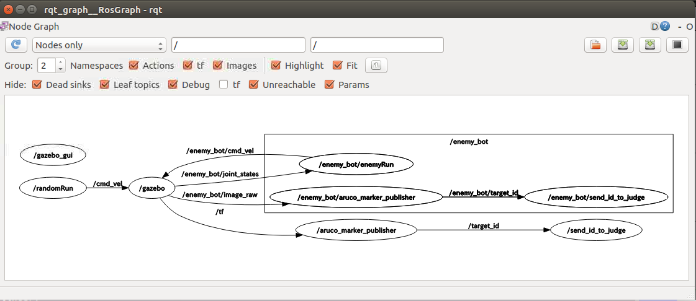

# チュートリアル
## (補足)fork元の変更を取り込む

fork している場合のfork元の変更に追従する具体的な手順は
- ローカルのmasterブランチに移動
- fork元のリポジトリをupstream という名前でリモートリポジトリに登録（名前はなんでもいい。登録済みならスキップ）
- upstream から最新のコードをfetch
- upstream/master を ローカルのmaster にmerge

```
cd ~/catkin_ws/src/burger_war
git checkout master
git remote add upstream https://github.com/OneNightROBOCON/burger_war.git
git fetch upstream
git merge upstream/master
```

参考 http://please-sleep.cou929.nu/track-original-at-forked-repo.html


### コンフリクトが起きた場合
mergeするとCONFLICTがおきることがある。
新旧のバージョンでマージできない変更があった場合、CONFLICTが発生する。
```
Auto-merging scripts/add_robocon2019.sh
Auto-merging burger_war/launch/your_burger.launch
CONFLICT (content): Merge conflict in burger_war/launch/your_burger.launch
Auto-merging burger_navigation/rviz/burger_navigation.rviz
Removing burger_navigation/rviz/blue_bot_navigation.rviz
Removing burger_navigation/rviz/_navigation.rviz
Removing burger_navigation/launch/multi_robot_navigation_run.launch
Automatic merge failed; fix conflicts and then commit the result.
```
上の例では、３行目で、your_burger.launchがCONFLICTしている。

まず、エディターを使って、手動で修正する。

その後、
```
cd burger_war/launch
git add your_burger.launch
```

最後に、git commitを実行して、自分のmasterブランチを更新する。
```
cd ~/catkin_ws/src/burger_war
git commit
```
commit logは必ず何かを書かないといけないので、何かを書いてください。

最後に、pushして、GitHubサーバー上のコードも更新する。
```
git push
```

## 自分のレポジトリをつくってCloneする
あらかじめGitHubで自分のアカウントを作成しログインしておきます。
[https://github.com/OneNightROBOCON/burger_war](https://github.com/OneNightROBOCON/burger_war)
を開いて、右上のForkを押します。

Linux環境で、ターミナルを開いて、下記の通り入力します。
(ターミナルは、左上Ubuntuマークを押して、terminalと入力し、「端末」を選ぶと開きます。)

XXXXXXXXXX のところが、自分のアカウント名になります。
```
cd ~/catkin_ws/src
git clone https://github.com/XXXXXXXXXX/burger_war
```
makeします。
```
cd ~/catkin_ws
catkin_make
```

## サンプルを実行する
下記を実行すると、審判サーバーが動き、Gazeboのモデルファイルが開かれます。
```
cd ~/catkin_ws/src/burger_war
bash scripts/sim_with_judge.sh
```

別のターミナルを開いて、下記を実行すると、ロボットが動き始めます。
```
cd ~/catkin_ws/src/burger_war
bash scripts/start.sh
```

### 審判サーバーが不要な場合
動きを確認したいだけの場合、毎回審判サーバーが動作するのは面倒なので、シミュレーションだけを実行することができます。

まず、Gazeboを開き、各ロボットのモデルファイルをロードします。
```
roslaunch burger_war setup_sim.launch
```
審判サーバーが見つからないというエラー(Try Send 0001 but, Requests Error ...)が出ますが、問題ありません。

次に、別のターミナルを開き、ロボットのプログラムを実行します。
```
roslaunch burger_war sim_robot_run.launch
```

自分のロボットのみ動かしたい場合は、下記で実行できます。
```
roslaunch burger_war your_burger.launch
```

## サンプルプログラムを理解する
### Launchファイルを理解する
サンプルプログラムはPythonで書かれていますが、その中身に入る前に、Launchファイルについて説明します。

ROSのプログラムは、LaunchファイルというXMLファイルで、起動の順番や依存関係などを定義し、起動するようになっています。

前述したとり、下記でロボットのプログラムを実行しています。
```
roslaunch burger_war sim_robot_run.launch
```
この`sim_robot_run.launch`が、Launchファイルです。
このファイルは、下記に入っています。
```
burger_war
└── burger_war
    └── launch  launchファイルの置き場
        └── sim_robot_run.launch  シミュレータ上で２台のロボットを動かすlaunchファイル
```
この中身を見てみましょう。

```xml
<?xml version="1.0"?>
<launch>

<!-- Your robot control node run  red side-->
  <include file="$(find burger_war)/launch/your_burger.launch">
    <arg name="side" value="r" />
  </include>

<!-- enemy bot run  blue side-->
  <group ns="enemy_bot">
    <node pkg="burger_war" type="enemy.py" name="enemyRun" output="screen"/>
  </group>

</launch>
```
`your_burger.launch`が自分側のロボットのプログラムになります。さらにLaunchファイルをincludeしていて、入れ子の構造になっています。
ちなみに、`<arg name="side"  ...`のところは、自分が赤側か青側かを定義しています。

`enemy.py`は敵側のサンプルプログラムです。ここで直接ノードを起動しています。

さらに、`your_burger.launch`を見てみましょう。
```xml
<?xml version="1.0"?>
<launch>
  <arg name="side" default="r"/> <!-- "b" = blue side, "r" = red side  -->

    <!-- You can change control program  -->

    <!-- sample program node -->
    <node pkg="burger_war" type="randomRun.py" name="randomRun" output="screen"/>
    <!-- END sample program node -->

    <!-- End of your space  -->
</launch>
```
ここで、`randomRun.py`を`randomRun`という名前でノードを立ち上げていることがわかります。

自分のロボット（赤側）を制御しているのは`randomRun.py`ということがわかりました。

### Pythonプログラムを理解する
`randomRun.py`を見てみましょう。

```python
#!/usr/bin/env python
# -*- coding: utf-8 -*-
'''
This is rumdom run node.
subscribe No topcs.
Publish 'cmd_vel' topic. 
mainly use for simple sample program

by Takuya Yamaguhi.
'''

import rospy
import random

from geometry_msgs.msg import Twist


class RandomBot():
    def __init__(self, bot_name="NoName"):
        # bot name 
        self.name = bot_name
        # velocity publisher
        self.vel_pub = rospy.Publisher('cmd_vel', Twist,queue_size=1)

    def calcTwist(self):
        value = random.randint(1,1000)
        if value < 250:
            x = 0.2
            th = 0
        elif value < 500:
            x = -0.2
            th = 0
        elif value < 750:
            x = 0
            th = 1
        elif value < 1000:
            x = 0
            th = -1
        else:
            x = 0
            th = 0
        twist = Twist()
        twist.linear.x = x; twist.linear.y = 0; twist.linear.z = 0
        twist.angular.x = 0; twist.angular.y = 0; twist.angular.z = th
        return twist

    def strategy(self):
        r = rospy.Rate(1) # change speed 1fps

        while not rospy.is_shutdown():
            twist = self.calcTwist()
            print(twist)
            self.vel_pub.publish(twist)

            r.sleep()


if __name__ == '__main__':
    rospy.init_node('random_run')
    bot = RandomBot('Random')
    bot.strategy()
```

このロボットはランダムに動きます。
Pythonプログラムの読み方、オブジェクト指向の書き方などを理解していないとわかりにくいと思いますが、
コアとなる部分のみ説明します。

`value = random.randint(1,1000)`で乱数を生成し、その後のif～elif～elseで前進後進と回転を定義しています。
変数`x`が前進後進の速度、変数`th`が回転速度を示しています。

関数`strategy`の中のwhile文は、ROSが動いている限り、無限ループとなるようになっています。
このループ内で、乱数生成と速度の決定を行い、速度指示を発行(publish)しています。

関数`__init__`(コンストラクタ)の中の下記の箇所で、どのトピックに対して発行を行う設定をしています。
```python
self.vel_pub = rospy.Publisher('cmd_vel', Twist,queue_size=1)
```


## サンプルプログラムを変更する
ではここでプログラムを変更して動かしてみましょう。

サンプルプログラムでは、最初からランダムな動きしかしませんが、
最初だけ一定時間前進し、正面の的をとるプログラムに変えてみましょう。

strategy関数の中身に追記をします。

```python
#!/usr/bin/env python
# -*- coding: utf-8 -*-
'''
This is rumdom run node.
subscribe No topcs.
Publish 'cmd_vel' topic. 
mainly use for simple sample program

by Takuya Yamaguhi.
'''

import rospy
import random

from geometry_msgs.msg import Twist


class RandomBot():
    def __init__(self, bot_name="NoName"):
        # bot name 
        self.name = bot_name
        # velocity publisher
        self.vel_pub = rospy.Publisher('cmd_vel', Twist,queue_size=1)

    def calcTwist(self):
        value = random.randint(1,1000)
        if value < 250:
            x = 0.2
            th = 0
        elif value < 500:
            x = -0.2
            th = 0
        elif value < 750:
            x = 0
            th = 1
        elif value < 1000:
            x = 0
            th = -1
        else:
            x = 0
            th = 0
        twist = Twist()
        twist.linear.x = x; twist.linear.y = 0; twist.linear.z = 0
        twist.angular.x = 0; twist.angular.y = 0; twist.angular.z = th
        return twist

    def strategy(self):
        r = rospy.Rate(1) # change speed 1fps
        
        # 下記を追加
        r.sleep()
        twist = Twist()
        twist.linear.x = 0.2; twist.linear.y = 0; twist.linear.z = 0
        twist.angular.x = 0; twist.angular.y = 0; twist.angular.z = 0
        print(twist)
        self.vel_pub.publish(twist)
        rospy.sleep(4.0)
        # 上記を追加

        while not rospy.is_shutdown():
            twist = self.calcTwist()
            print(twist)
            self.vel_pub.publish(twist)

            r.sleep()


if __name__ == '__main__':
    rospy.init_node('random_run')
    bot = RandomBot('Random')
    bot.strategy()
```

修正が終わったらmakeします。(ただしPythonの場合はmakeはほとんどの場合、不要です。)
新しくファイルを作った場合、[実行権限に気をつけてください](#Pythonプログラムの実行権限について)。
```
cd ~/catkin_ws
catkin_make
```
実行の方法は、[審判サーバーが不要な場合](#審判サーバーが不要な場合)と同じです。
なお、毎回Gazeboを立ち上げるのが時間がかかるので、[Gazeboをリセットする](#Gazeboをリセットする)が便利です。

最初だけ前進し、その後ランダムに動くようになったと思います。

## ROSツールの使い方
### CUIツール
#### rosnode
[自分の機体のみを実行中](#審判サーバーが不要な場合)の時、下記を実行してみます。

```
rosnode list
```
実行結果は下記となります。
```
/aruco_marker_publisher
/enemy_bot/aruco_marker_publisher
/enemy_bot/send_id_to_judge
/gazebo
/gazebo_gui
/randomRun
/rosout
/send_id_to_judge
```
このリストは起動しているノードの一覧を現しています。自分の機体のノード`randomRun`が起動していることが分かります。

その他、下記のような機能があります。
```
rosnode is a command-line tool for printing information about ROS Nodes.

Commands:
	rosnode ping	test connectivity to node
	rosnode list	list active nodes
	rosnode info	print information about node
	rosnode machine	list nodes running on a particular machine or list machines
	rosnode kill	kill a running node
	rosnode cleanup	purge registration information of unreachable nodes
```

詳しくは[ROS Wiki/ROSのノードを理解する](http://wiki.ros.org/ja/ROS/Tutorials/UnderstandingNodes)を参照してください。

#### rostopic
おなじく[自分の機体のみを実行中](#審判サーバーが不要な場合)の時、下記を実行してみます。
```
rostopic list
```
下記のように、配信されているトピックの一覧が出力されます。(一部省略)
```
/aruco_marker_publisher/debug
...
/aruco_marker_publisher/markers_list
/aruco_marker_publisher/result
/aruco_marker_publisher/result/compressed
...
/camera_info
/clock
/cmd_vel
/enemy_bot/aruco_marker_publisher/debug
...
/enemy_bot/war_state
/gazebo/link_states
/gazebo/model_states
/gazebo/parameter_descriptions
/gazebo/parameter_updates
/gazebo/set_link_state
/gazebo/set_model_state
/gazebo_gui/parameter_descriptions
/gazebo_gui/parameter_updates
/image_raw
/image_raw/compressed
/image_raw/compressed/parameter_descriptions
/image_raw/compressed/parameter_updates
/image_raw/compressedDepth
/image_raw/compressedDepth/parameter_descriptions
/image_raw/compressedDepth/parameter_updates
/image_raw/theora
/image_raw/theora/parameter_descriptions
/image_raw/theora/parameter_updates
/imu
/joint_states
/odom
/rosout
/rosout_agg
/scan
/target_id
/tf
/tf_static
/war_state
```
ここで、例えば`/scan`はLiDARの出力です。どのようなデータが出力されているか見てみましょう。
```
rostopic echo /scan
```
下記が出力されます。（一部略）。永遠に続くのでCtrl+cで停止します。
```
header: 
  seq: 6
  stamp: 
    secs: 1718
    nsecs: 347000000
  frame_id: "base_scan"
angle_min: 0.0
angle_max: 6.28318977356
angle_increment: 0.0175019223243
time_increment: 0.0
scan_time: 0.0
range_min: 0.119999997318
range_max: 3.5
ranges: [0.4277633726596832, 0.4296434819698334, 0.43120771646499634, 0.4358418583869934, 0.4486405551433563, 0.4571656882762909, 0.4516488313674927, 0.4592909812927246, 0.4651682376861572, 0.48023778200149536, 0.4918324053287506, 0.5023503303527832, 0.5101311206817627, 0.5131633281707764, 0.5489659309387207, 0.5505691766738892, 0.5575047731399536, 1.7604784965515137, 1.7517564296722412, 1.7542954683303833, 1.679626703262329, 1.5858582258224487, 1.464978814125061, 1.3695951700210571, 1.3043755292892456, 1.2319663763046265, 1.1746677160263062, 1.1228779554367065, 1.0817313194274902, 1.0330837965011597, 0.993511974811554, 0.9555464386940002, 0.9220733642578125, 0.8895208239555359, 0.8737884163856506, 0.8351966142654419, 0.7984957098960876, 0.7917566895484924, 0.780123233795166, 0.7271418571472168, 0.7341302037239075, 0.7160707712173462,   .........
```
他に、コマンドだけで指令を出すこともできます。`/cmd_vel`は走行の指示（速度）を示すトピックです。
下記を入力するときすべてを入力する必要はありません。
`/cmd_vel `まで入力したら、あとはTabを何回か押していくと補完されます。最後まで出力されたら、左矢印キーで戻ってxの部分を変更します。
Turtlebot3 burgerでは前後と旋回しかないので、`linear: x`と`angular: z`しか意味はありません。
```
rostopic pub /cmd_vel geometry_msgs/Twist "linear:
  x: 0.2
  y: 0.0
  z: 0.0
angular:
  x: 0.0
  y: 0.0
  z: 0.0" 
```

その他、下記のような機能があります。
```
rostopic is a command-line tool for printing information about ROS Topics.

Commands:
	rostopic bw	display bandwidth used by topic
	rostopic delay	display delay of topic from timestamp in header
	rostopic echo	print messages to screen
	rostopic find	find topics by type
	rostopic hz	display publishing rate of topic    
	rostopic info	print information about active topic
	rostopic list	list active topics
	rostopic pub	publish data to topic
	rostopic type	print topic or field type
```

詳しくは
[ROS Wiki/ROSトピックの理解](http://wiki.ros.org/ja/ROS/Tutorials/UnderstandingTopics)
を参照してください。

#### その他
[ROSのサービスとパラメータを理解する](http://wiki.ros.org/ja/ROS/Tutorials/UnderstandingServicesParams)

[ROS Wiki/Tutorials](http://wiki.ros.org/ja/ROS/Tutorials)
### GUIツール
#### rqt_graph
```
rqt_graph
```
を起動すると、下記のようなGUIツールが立ち上がります。楕円はノードを現していて、矢印はトピックです。これを見ることで、どのノードとトピックの状況がわかります。

たとえば、左端の`/raundomRun`は自分の機体のノードであり、`/cmd_vel`をPublishしており、それを`/gazebo`ノードが受け取っていることが分かります。

#### Rviz
```
rviz
```
を起動すると、GUIツールが立ち上がります。これはLiDARデータやカメラ画像を３ＤでVisualizeする非常に強力なツールです。

左下の`Add`を押してみましょう。
`By display type`タブから`Image`を選択します。
リストに追加されたImageを展開し、`Image Topic`のプルダウンメニューを開き、`/aruco_marker_publisher/result`をクリックすると、
カメラの画像が表示されます。

さらに、`Add`を押して、`By topic`タブから`/scan`⇒`LaserScan`を選びます。
次に、リストの中から、`Global Options`⇒`Fixed Frame`のところへ`base_scan`と入力します。
すると、右側のエリアにLiDARのデータが表示されます。


#### rqt
`rqt`はROS上でGUIツールを開発するフレームワークです。
上記の`rqt_graph`以外にも、
リアルタイムにグラフ生成する`rqt_plot`,カメラ等の画像を見る`rqt_image_view`,ログを再生する`rqt_bag`などが良く使われます。

`rqt`を起動すると、多くの機能をPlugin形式で見ることができます。


### TIPS
#### Gazeboをリセットする
下記を実行するとGazeboが初期状態にリセットされます。毎回Gazeboを再起動する必要性が無く便利です。
```
rosservice call /gazebo/reset_simulation "{}"
```
### Pythonプログラムの実行権限について
Pythonプログラムは単なるテキストファイルですが、実行権限が付与されていないとノードの起動に失敗するので注意が必要です。
```
cd ~/catkin_ws/src/burger_war/burger_war/scripts
ls -l

-rw-r--r-- 1 ubuntu ubuntu 1629 Feb 10 12:07 randomRun2.py
```
出力結果が上記であると実行権限が無い状態です。`chmod +x filename`で実行権限を付与して下さい。
```
chmod +x randomRun2.py
ls -l

-rwxr-xr-x 1 ubuntu ubuntu 1629 Feb 10 12:07 randomRun2.py
```

### キーボードで動かす
Turtlebot3のパッケージを使えば、キーボードでロボットを動かせます。
デバッグに便利です。

```
export TURTLEBOT3_MODEL=burger
roslaunch turtlebot3_teleop turtlebot3_teleop_key.launch
```

詳しくは、[TurtleBot3 e-Manual](http://emanual.robotis.com/docs/en/platform/turtlebot3/teleoperation/#teleoperation)をご覧ください。

## センサー情報を読む
## カメラ画像を読む
## SLAMで走る
## パッケージを使う
## デバッグ
